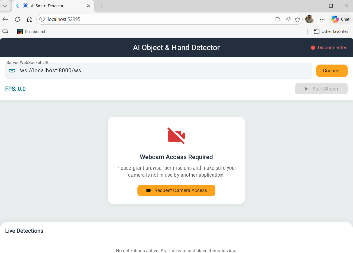
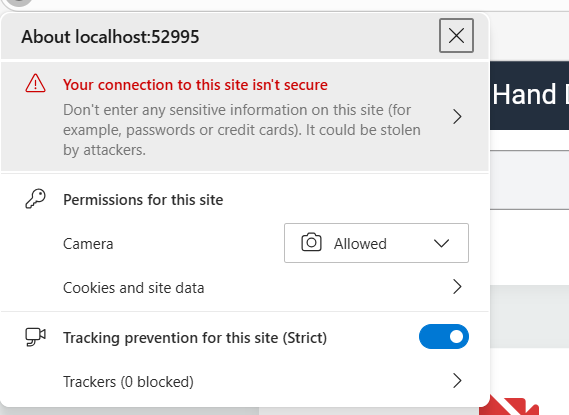

# AI Educational Smart Detector

An interactive, real-time object tracking and hand-gesture landmark detection system. The application uses a custom-trained **YOLOv8** model to recognize educational objects and **MediaPipe** to track hand landmarks (e.g. index fingertips), rendering overlays dynamically.

The system features both a **web/mobile Flutter application** (designed with a sleek, light-colored Amazon theme) and a **standalone Python desktop interface**.



---

## 🌟 Key Features

* **Multi-Platform UI:** Runs in the browser (Microsoft Edge), on the Android Emulator, or on physical Android devices.
* **Dual Run Configurations:** 
  1. **Client-Server Architecture:** Low-latency video streaming from the Flutter client to a FastAPI WebSocket server which returns detection coordinates.
  2. **Standalone Desktop Application:** Local OpenCV-based capture and model inference.
* **YOLOv8 Object Tracking:** High-performance detection of educational objects (`Book`, `Cell Phone`, `Keyboard`, `Mouse`, `Remote`).
* **MediaPipe Hand Tracking:** Real-time 21-point hand joint tracking with a customized blue highlight on the index fingertip.
* **Dynamic Webcam Selector:** Interactive dropdown selector that resolves hardware/permission locks by letting users switch input cameras on-the-fly.

---

## 🛠️ Technology Stack

* **Machine Learning:** `PyTorch`, `Ultralytics YOLOv8`, `MediaPipe Tasks API`
* **Backend WebSocket Server:** `FastAPI`, `Uvicorn`, `OpenCV`
* **Frontend Application:** `Flutter` (Web / Android)

---

## 📋 System Setup

Before running the application, make sure your python environments are configured.

### 1. Python Dependencies
The project requires Python 3.11+. Install the required libraries:
```bash
pip install torch torchvision
pip install ultralytics mediapipe opencv-python fastapi uvicorn websockets
```

### 2. Download MediaPipe Model
The server uses the modern MediaPipe Tasks API. Ensure you have the `hand_landmarker.task` file in your root project directory. If it is missing, download it from Google:
```powershell
Invoke-WebRequest -Uri "https://storage.googleapis.com/mediapipe-models/hand_landmarker/hand_landmarker/float16/1/hand_landmarker.task" -OutFile "hand_landmarker.task"
```

---

## 🚀 How to Run the Project

Always launch the backend WebSocket server first if you are using the Flutter app.

### Step 1: Start the Backend Server
From the root directory (`AI_Object_Detection`), start the FastAPI server:
```bash
py server.py
```
The server will start listening for frame streams at `ws://localhost:8000/ws`.

---

### Step 2: Choose Your Frontend Client

#### Option A: Running on Microsoft Edge (Web)
1. Open a new terminal and navigate to the `app` folder:
   ```bash
   cd app
   ```
2. Launch the Flutter app targeting Microsoft Edge:
   ```bash
   flutter run -d edge
   ```
3. Edge will launch automatically.
4. **Grant camera permissions** in the browser. (If the camera is occupied or doesn't start, use the **Camera Dropdown** to select your active RGB camera and click **Request Camera Access**).
   
   

5. Click **Connect** (Amazon Gold button) to connect to `ws://localhost:8000/ws`.
6. Click **Start Stream** (Amazon Orange button) to start the real-time detection overlay.

#### Option B: Running on Android Emulator
1. Start your Android Emulator (e.g. Pixel 6) in Android Studio.
2. In the emulator's **Extended Controls** (three dots `...` on the sidebar):
   * Go to the **Camera** tab.
   * Change both the **Front Camera** and **Back Camera** from *Virtual Scene* to **`Webcam0`** to forward your laptop camera.
3. Open a terminal, navigate to the `app` folder, and launch:
   ```bash
   cd app
   flutter run
   ```
4. On the emulator app UI:
   * **Grant camera permissions** on the screen.
   * Change the WebSocket Server URL input field from `ws://localhost:8000/ws` to **`ws://10.0.2.2:8000/ws`** *(10.0.2.2 is the special IP Android uses to connect to your computer's local port)*.
5. Click **Connect** and **Start Stream**!

#### Option C: Running on a Physical Android Phone
1. Connect your physical phone to your computer via USB (ensure USB Debugging is enabled in Developer Options) or copy the generated APK:
   * Location: `app/build/app/outputs/flutter-apk/app-release.apk`
2. **Wi-Fi Rule:** Both your computer and your phone must be connected to the **same Wi-Fi network**.
3. Find your computer's local IP address (on Windows, run `ipconfig` in PowerShell). Under your Wi-Fi Adapter, locate the IPv4 Address (e.g., `192.168.31.124`).
4. Launch the app on your phone.
5. In the app UI:
   * Change the Server URL input to: **`ws://<your-computer-ip>:8000/ws`** (e.g. `ws://192.168.31.124:8000/ws`).
   * Grant camera permissions when prompted.
6. Click **Connect** and **Start Stream**!

#### Option D: Standalone Desktop Interface (No Flutter needed)
If you want to run the python-only OpenCV desktop demo without starting a server or browser:
```bash
py main.py
```
*Press **`q`** in the video window to quit and release the camera lock.*

---

## 🏋️ Training & Data Conversion (Developer Guide)

If you wish to fine-tune the model on custom datasets:
1. **Convert Data:** Convert Roboflow CSV annotations to YOLO format:
   ```bash
   py convert.py
   ```
2. **Train Model:** Fine-tune `yolov8s.pt` using GPU/CPU:
   ```bash
   py train.py
   ```
